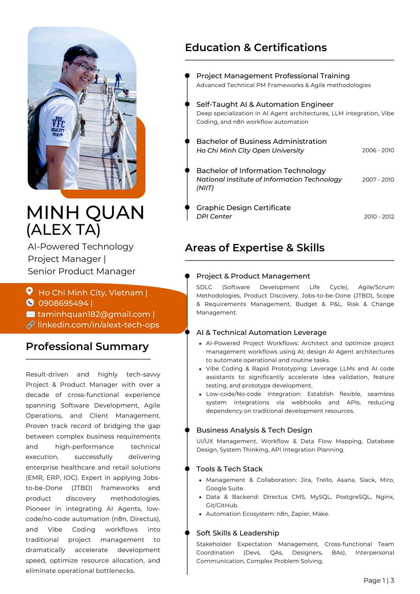
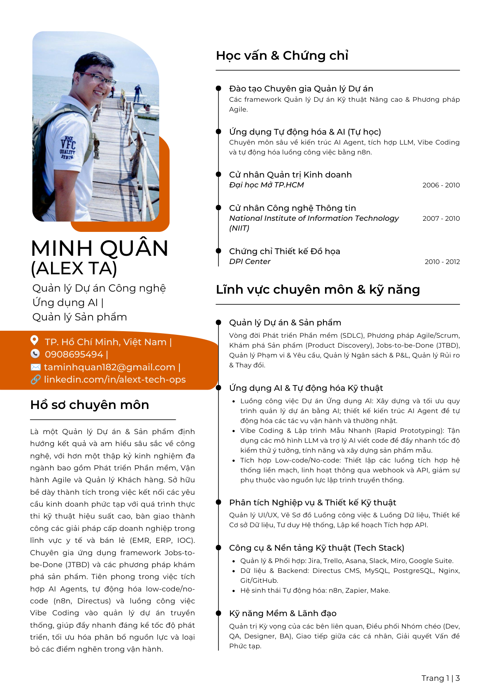

# Minh Quân (Alex Ta)

Quản lý dự án công nghệ ứng dụng AI với tư duy sản phẩm rõ, kỷ luật vận hành tốt và thiên hướng bàn giao thực tế.

## Tóm Tắt Hồ Sơ

Minh Quân có hơn một thập kỷ kinh nghiệm đa chức năng trải dài qua triển khai phần mềm, điều phối sản phẩm, quản lý khách hàng, vận hành lưu trú và thiết kế quy trình có AI hỗ trợ.

Anh phù hợp nhất với những vai trò cần:

- Biến độ phức tạp trong kinh doanh thành kế hoạch thực thi có cấu trúc.
- Kết nối lập trình, QA, thiết kế, nghiệp vụ và vận hành vào cùng một nhịp làm việc.
- Kết hợp tư duy sản phẩm với kỷ luật triển khai thực tế.
- Tận dụng AI, n8n và tạo mẫu nhanh để rút ngắn chu kỳ vận hành.

## Nhìn Nhanh

- Trọng tâm hiện tại: triển khai dự án, vận hành sản phẩm, quy trình AI
- Vùng thế mạnh: hệ thống y tế, ERP, nền tảng nội bộ, mô hình dịch vụ
- Phong cách làm việc: có cấu trúc, thực tế, ít hình thức, bám kết quả
- Công cụ quen thuộc: Jira, Trello, Asana, Slack, Miro, Directus, MySQL, PostgreSQL, Git/GitHub, n8n, Zapier, Make

## Năng Lực Nổi Bật

### Quản Lý Dự Án Và Sản Phẩm

- Lập kế hoạch SDLC và quản trị bàn giao
- Triển khai Agile và Scrum
- Khám phá sản phẩm và làm rõ phạm vi
- Điều phối stakeholder và tháo gỡ điểm nghẽn

### Ứng Dụng AI Và Tự Động Hóa

- Tư duy quy trình với AI Agent
- Thiết kế tự động hóa bằng n8n
- Tạo mẫu nhanh với LLM
- Tích hợp low-code và vận hành theo hướng webhook

### Tư Duy Nghiệp Vụ Và Hệ Thống

- Vẽ luồng công việc
- Làm rõ yêu cầu
- Định hướng dữ liệu
- Phối hợp UI/UX và API

## Kinh Nghiệm Tiêu Biểu

### Dolphin Solutions | Quản lý Dự án, Phần mềm & Công nghệ

- Phụ trách điều phối và theo dõi thực thi cho phần mềm y tế cấp doanh nghiệp.
- Làm việc với các hệ thống EMR, IOC và kiosk thông minh.
- Kết nối triển khai kỹ thuật với bối cảnh vận hành thực tế.

### Tư Vấn Công Nghệ Độc Lập Và Xây Dựng Sản Phẩm

- Xây dựng ERP tùy biến, CMS và hệ thống tri thức có AI hỗ trợ.
- Thiết kế hệ thống nội bộ phục vụ vận hành và tổ chức công việc.
- Dùng công cụ tự động hóa hiện đại để giảm thao tác tay và tăng tốc phản hồi.

### AUHOME / CITYHOME | Đồng Sáng Lập Và Vận Hành

- Quản lý vận hành căn hộ dịch vụ, nhà cung cấp, tỷ lệ lấp đầy và cải tạo.
- Chuẩn hóa quy trình để duy trì hiệu quả vận hành xuyên suốt nhiều địa điểm.

## Học Vấn Và Chứng Chỉ

- Đào tạo Chuyên gia Quản lý Dự án
- Ứng dụng Tự động hóa & AI (Tự học)
- Cử nhân Quản trị Kinh doanh, Đại học Mở TP.HCM
- Cử nhân Công nghệ Thông tin, NIIT
- Chứng chỉ Thiết kế Đồ họa, DPI Center

## Tải CV

<table>
  <tr>
    <td width="50%">
      
      
<strong>CV 2026 English</strong>

      
Dùng cho hồ sơ quốc tế, vai trò sản phẩm, vai trò triển khai dự án và bối cảnh giao tiếp toàn cầu.

      

        <a href="assets/cv/MinhQuan_CV2026_EN.pdf">Tải PDF</a> 
        <a href="https://drive.google.com/file/d/1qYG4K-urKQqVbU2mhALp5Nuvwck_pdhP/view?usp=sharing">Mở bản Google Drive</a>
      

    </td>
    <td width="50%">
      
      
<strong>CV 2026 Tiếng Việt</strong>

      
Dùng cho cơ hội trong nước, trao đổi với đối tác Việt Nam và các tình huống cần diễn đạt tự nhiên bằng tiếng Việt.

      

        <a href="assets/cv/MinhQuan_CV2026_VN.pdf">Tải PDF</a> 
        <a href="https://drive.google.com/file/d/1cmANPE_H79V9B6X3HHu7vdROoRthpsMY/view?usp=sharing">Mở bản Google Drive</a>
      

    </td>
  </tr>
</table>

## Mục Đích Của Repo

Đây là public repo dùng để giới thiệu ngắn gọn về Minh Quân và cung cấp link tải CV.

Repo này tồn tại để:

- giới thiệu chân dung nghề nghiệp ở mức ngắn gọn, dễ đọc,
- cung cấp link tải trực tiếp cho bộ CV hiện tại,
- hỗ trợ cả tiếng Anh và tiếng Việt,
- phục vụ việc chia sẻ qua GitHub với hình ảnh và tài nguyên công khai.

Repo này không phải source code của một sản phẩm phần mềm.

## Liên Hệ

- Email: `taminhquan182@gmail.com`
- Điện thoại: `0908695494`
- LinkedIn: `https://linkedin.com/in/alext-tech-ops`
